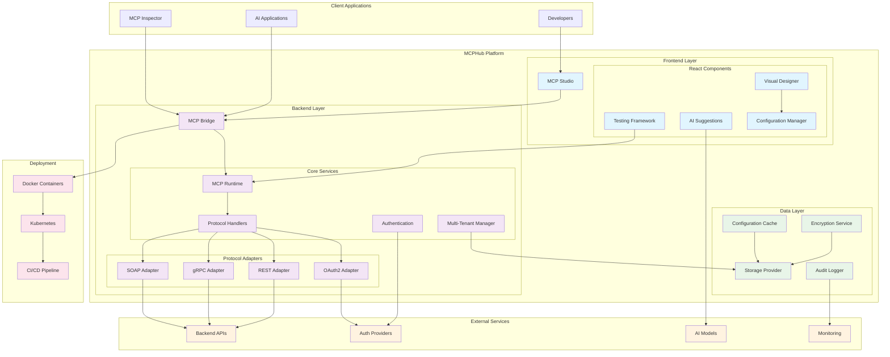
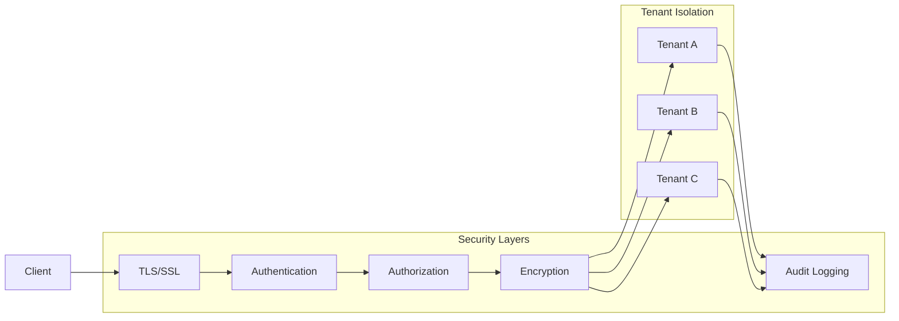

# MCPHub Architecture Diagram

## System Architecture

## Component Details

### Frontend Layer (MCP Studio)
- **Technology**: Next.js 15 + React 19 + TypeScript + Tailwind CSS
- **Port**: 3000 (development), 80/443 (production)
- **Features**: Visual design, real-time testing, AI suggestions, configuration management

### Backend Layer (MCP Bridge)
- **Technology**: Java 21 + Quarkus 3.6.4 + Maven
- **Port**: 8080 (public), 8081 (admin)
- **Features**: MCP protocol implementation, multi-tenant support, authentication

### Data Layer
- **Storage**: Database (PostgreSQL) or Memory
- **Encryption**: AES-256-GCM with PBKDF2
- **Caching**: In-memory configuration cache
- **Audit**: Comprehensive audit logging

### External Integrations
- **Backend APIs**: REST, gRPC, SOAP, GraphQL services
- **Auth Providers**: OAuth2, JWT, API key providers
- **AI Models**: OpenAI, Anthropic, Groq
- **Monitoring**: Observability and metrics

### Deployment Options
- **Docker**: Containerized deployment
- **Kubernetes**: Orchestrated scaling
- **CI/CD**: Automated deployment pipelines

## Data Flow

1. **Configuration Creation**: Developers use MCP Studio to create configurations
2. **Storage**: Configurations stored in database with encryption
3. **Deployment**: Configurations deployed to MCP Bridge runtime
4. **Protocol Handling**: MCP Bridge handles JSON-RPC requests
5. **API Execution**: Protocol adapters execute real API calls
6. **Response**: Results returned to AI applications

## Security Architecture

## Scalability Design

- **Horizontal Scaling**: Multiple MCP Bridge instances
- **Load Balancing**: Distribute requests across instances
- **Caching**: Configuration and response caching
- **Database Sharding**: Tenant-based data partitioning
- **Auto-scaling**: Kubernetes-based auto-scaling

## High Availability

- **Multi-Region**: Deploy across multiple regions
- **Failover**: Automatic failover mechanisms
- **Backup**: Regular configuration backups
- **Monitoring**: Comprehensive health monitoring
- **Recovery**: Disaster recovery procedures