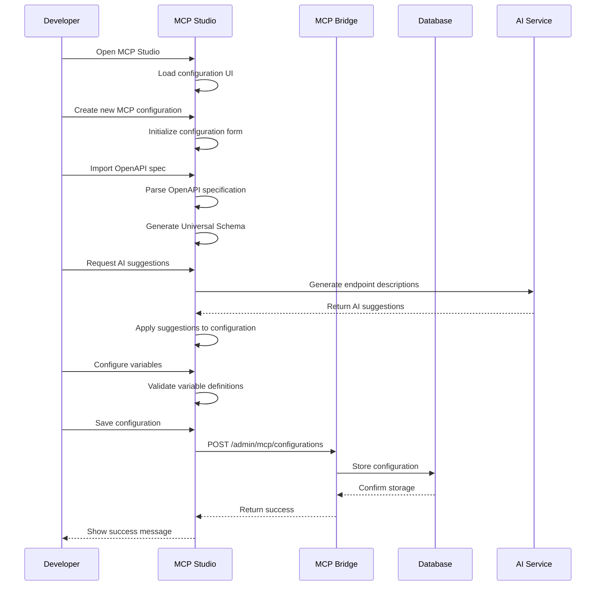
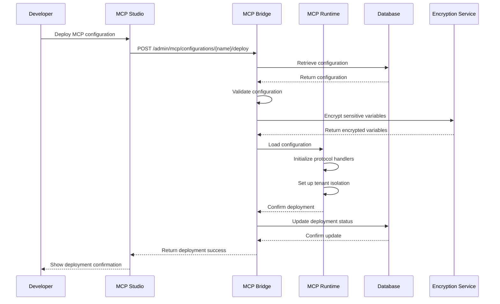
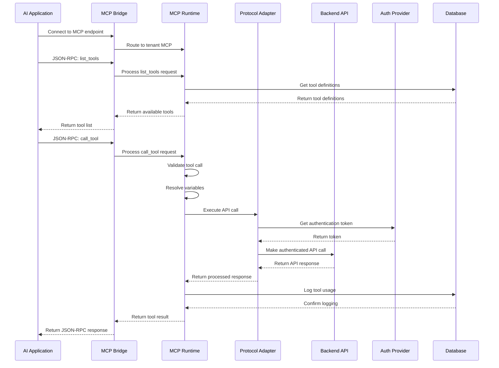
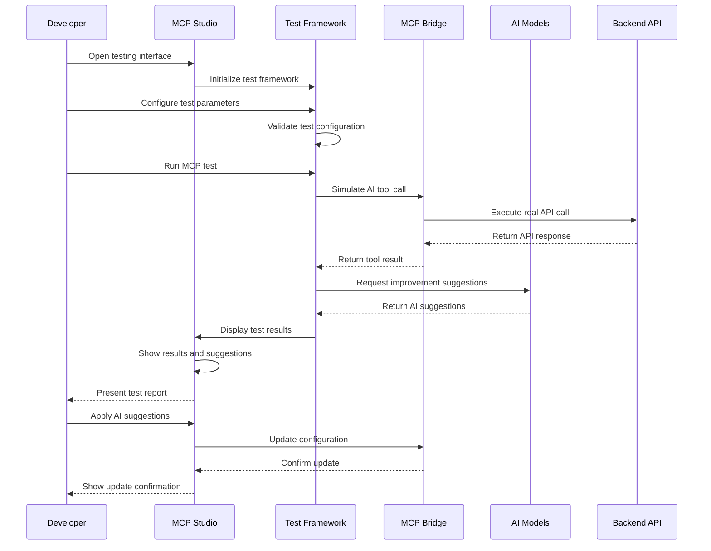
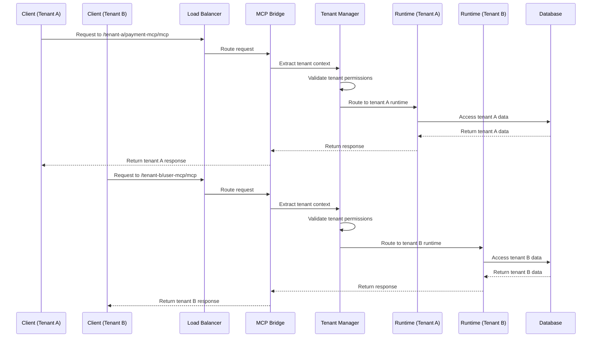
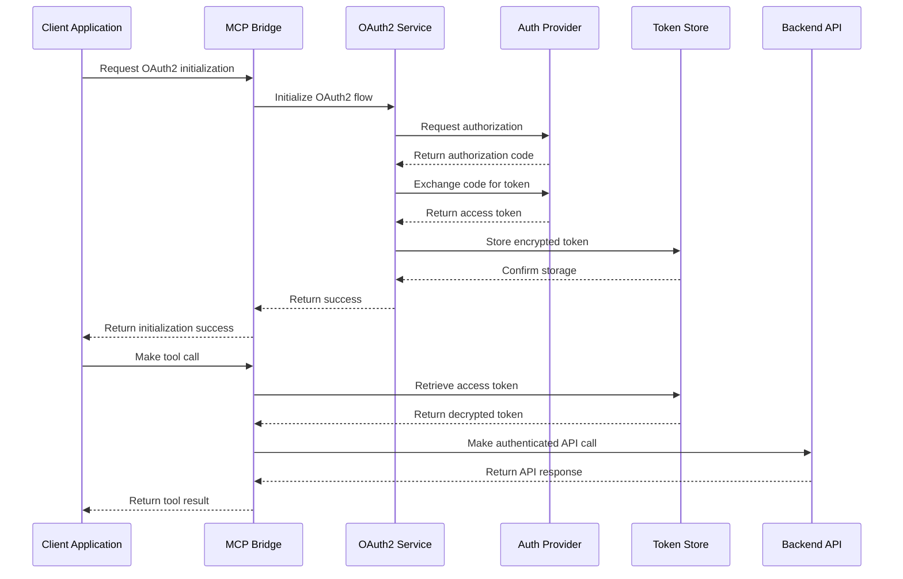
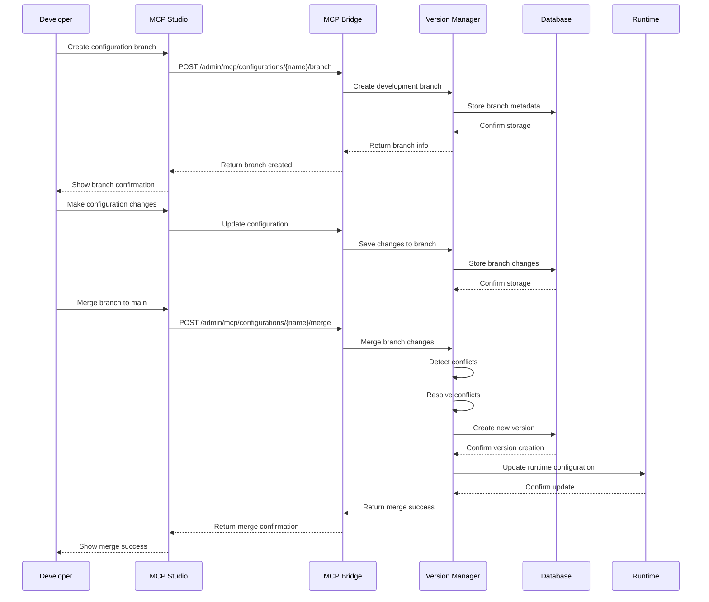
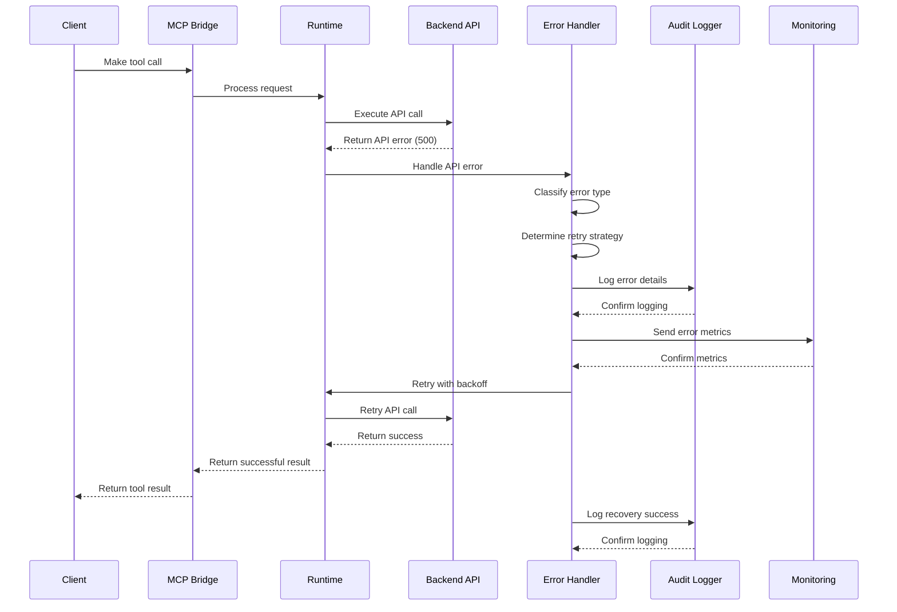

# MCPHub Sequence Diagrams

## 1. MCP Configuration Creation Flow

## 2. MCP Deployment Flow

## 3. AI Application MCP Usage Flow

## 4. Testing and Validation Flow

## 5. Multi-Tenant Request Flow

## 6. OAuth2 Authentication Flow

## 7. Configuration Version Management Flow

## 8. Error Handling and Recovery Flow

## Key Sequence Characteristics

### Synchronous Operations
- Configuration creation and updates
- Tool execution (with timeouts)
- Authentication flows

### Asynchronous Operations
- AI suggestion generation
- Audit logging
- Monitoring and metrics

### Error Handling
- Automatic retry with exponential backoff
- Comprehensive error logging
- Graceful degradation

### Security Measures
- Token encryption at rest
- Tenant isolation validation
- Audit trail for all operations

### Performance Optimization
- Configuration caching
- Connection pooling
- Lazy loading of resources